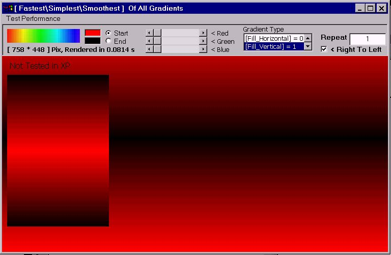



## GradientFill API ??? Thats Simple\!\!\!

### Description

I am sure that this is the 'Fastest' routine in PSC to render 'Positioned' - 'Repeated' gradients. The gradients are 'Smoother' than the same implimentation using 'DIB sections', because it uses 'GradientFill' API. The code is so 'Compact' and 'Simple' because it is based on an excellent thought by 'paul_turcksin' to use 'CopyMemory' to bypass color Bytes to TRIVERTEX Structure used in 'GradientFill' API. The code can draw 'Horizontal' and 'Vertical' gradients with any number of 'Repeats'. Hope you enjoy!! and please leave your comments!!!, Jim Jose ;)
 
### More Info
 

             |
---                |---
**Submitted On**   |2004-01-29 23:33:42
**By**             |[JJJJJJJJ](https://github.com/Planet-Source-Code/PSCIndex/blob/master/ByAuthor/jjjjjjjj.md)
**Level**          |Intermediate
**User Rating**    |5.0 (20 globes from 4 users)
**Compatibility**  |VB 6\.0
**Category**       |[Graphics](https://github.com/Planet-Source-Code/PSCIndex/blob/master/ByCategory/graphics__1-46.md)
**World**          |[Visual Basic](https://github.com/Planet-Source-Code/PSCIndex/blob/master/ByWorld/visual-basic.md)
**Archive File**   |[Fastest\_Sm1901196142005\.zip](https://github.com/Planet-Source-Code/jjjjjjjj-gradientfill-api-thats-simple__1-61105/archive/master.zip)

